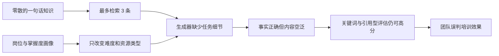

# 培训内容具体化与可信评测整改方案

> 文档状态：C0–C4 已完成首轮实现，待独立复现与专业核验<br>
> 制定日期：2026-08-08  
> 首轮执行日期：2026-08-08<br>
> 适用项目：智策育训  
> 整改范围：知识数据、画像、生成、审核、评测、界面与验收证据  
> 不包含：代替专业人员完成人工审核、训练大模型、引入 LangGraph/Neo4j 等重框架

## 一、执行摘要

当前系统已经能够完成“检索—画像—生成—审核—评估”的离线闭环，但生成结果仍容易表现为：

- 把检索到的知识重新复述一遍；
- 不同岗位、不同能力水平的正文结构高度相似；
- 实操指南缺少真实任务、判断点和合格标准；
- 测试题缺少明确答案、评分规则和错后补学路径；
- 内容虽然引用正确、审核通过，却不一定能支持一次真实培训。

这不是单靠修改提示词可以解决的问题。根因是：**知识库主要提供零散事实，画像主要提供岗位与掌握度，内容契约只要求一段正文，而评估又主要检查引用、关键词和资源类型。** 在这种输入和验收方式下，系统天然倾向于生成“安全但空泛”的内容。

本次整改采用以下主线：

> 将系统的生成目标从“围绕若干知识点写一篇文章”，调整为“基于一个完整培训任务包，生成可执行、可考核、可追溯的岗位微课”。

整改不重写现有四 Agent 架构，不废弃已有字段，不增加重框架。先完成一条黄金微课的纵向闭环，通过互验后，再扩展到三个稳定岗位。

## 二、问题证据与根因

### 2.1 知识粒度只能支撑事实复述

当前 `data/knowledge.json` 的稳定字段主要是：

```json
{
  "知识ID": "CNC-SAFE-001",
  "内容": "操作或安装机床前，相关人员应先熟悉设备操作说明和安全说明。",
  "来源": "Haas Desktop Mill Operator's Manual Supplement",
  "来源定位": "URL 或章节",
  "主题": ["数控机床安全操作", "岗前培训"],
  "验证状态": "已验证"
}
```

这类条目适合回答“某项要求是什么”，但不足以独立支撑：

- 培训完成后学员要能做什么；
- 在什么设备、条件和工序下操作；
- 操作按什么顺序进行；
- 每一步如何判断正确或异常；
- 哪些错误会带来什么风险；
- 如何练习、评分和补学。

因此，即使大模型完全遵守知识边界，也只能围绕几句话扩写。若要求它自行补充操作细节，又会引入无依据事实和安全风险。

### 2.2 画像只能改变难度标签，不能提供真实培训场景

当前画像能够表达岗位、技能掌握度、目标技能、推荐难度和学习路径。这对冷启动是有效的，但以下信息仍然缺失：

- 学员从业年限或是否首次上岗；
- 实际使用的设备类型或型号；
- 当前要完成的具体工作任务；
- 曾经出现的错误、错题原因或薄弱步骤；
- 可用培训时长；
- 培训环境是课堂、仿真还是现场带教；
- 本次培训的完成标准。

没有这些上下文时，“个性化”容易退化为入门版多解释、应用版多步骤、进阶版多开放题，仍然不是面向真实任务的差异化。

### 2.3 内容契约不要求教学完整性

当前内容契约的核心是：

```json
{
  "类型": "定制讲义 | 实操指南 | 分阶测试题",
  "标题": "字符串",
  "正文": "Markdown",
  "引用来源": [],
  "引用知识ID": [],
  "生成模式": "字符串"
}
```

只要正文非空、引用合法，就满足基础结构。契约没有强制要求：

- 可观察的学习目标；
- 前置条件；
- 分步操作与判断标准；
- 风险点和停止条件；
- 练习任务；
- 标准答案或评分量规；
- 不通过后的补学路径。

这意味着“泛泛而谈”在结构上仍然是合法输出。

### 2.4 评估不能识别“正确但没用”

当前单份内容诊断主要依据：

- 事实是否能与知识条目相似匹配；
- 是否出现专业主题词；
- 平均句长和句子数量；
- 资源类型是否匹配推荐难度；
- 是否引用了本次知识。

这些指标可以发现部分引用和表达问题，但不能回答：

- 学员能否照着内容完成任务；
- 步骤是否缺少关键判断点；
- 练习与学习目标是否一致；
- 考核是否有答案和合格标准；
- 两种画像是否产生了有意义的教学差异。

同时，现有 QA 初稿直接从知识条目生成，评测时又按预期知识 ID 取出正确知识，并强制使用离线模板，因此容易形成“用同一份数据出题、给答案和判卷”的自证闭环。

### 2.5 根因链



## 三、整改目标与非目标

### 3.1 总目标

在不训练模型、不引入重框架的前提下，使系统至少能够稳定生成一条：

- 可执行；
- 可考核；
- 对不同画像有可观察差异；
- 所有专业事实可追溯；
- 未覆盖信息明确留空或拒绝补充；
- 能通过完整链路盲测的岗位微课。

### 3.2 第一优先级目标

先打透一条黄金场景：

> 数控机床操作工——开机前安全检查与门联锁验证微课。

选择该场景的原因：

- 已有多条可追溯安全知识；
- 容易设计正常、异常和拒答样例；
- 可以清楚展示入门、应用、进阶三种教学差异；
- 安全边界明确，适合展示审核与停止条件；
- 评委能够直观判断内容是否可执行。

只有第一条黄金场景通过退出门槛后，才扩展：

1. CNC 编程员——主轴、冷却液、程序结束指令与安全运行检查；
2. 质检员——卡尺测量、读数、误差判断与结果记录。

### 3.3 非目标

本轮明确不做：

- 不扩展大量新岗位；
- 不训练 DKT/BKT 或任何大模型；
- 不用一个更长的 Prompt 假装解决数据缺口；
- 不让模型自由编造设备参数和操作规程；
- 不以三模型投票替代专业内容设计；
- 不追求一次生成完整企业课程体系；
- 不把自动评分冒充学习效果或真实生产效果。

## 四、目标产物：岗位培训任务包

### 4.1 产品定位调整

短期内不要把单次输出宣传为“完整课程”。建议统一称为：

> 15–30 分钟、围绕一个岗位任务的个性化培训微课或任务卡。

这一定位与当前数据规模更匹配，也更容易形成可演示、可验收的产品闭环。

### 4.2 新增任务包数据，不破坏原知识库

保留 `data/knowledge.json` 作为事实与来源的唯一可信底座，新增：

```text
data/training_tasks.json
```

建议任务包结构如下：

```json
{
  "任务包ID": "TASK-CNC-SAFE-CHECK-001",
  "岗位": "数控机床操作工",
  "任务名称": "开机前安全检查与门联锁验证",
  "适用范围": {
    "设备类型": "带防护门和门联锁的数控机床",
    "具体型号": "未指定时必须提示查阅本机说明书",
    "培训环境": ["课堂讲解", "仿真", "现场带教"],
    "建议时长分钟": 20
  },
  "前置技能": ["识别急停按钮", "理解防护门作用"],
  "知识ID": ["CNC-SAFE-001", "CNC-SAFE-004", "CNC-SAFE-009", "CNC-SAFE-010"],
  "学习目标": [
    {
      "行为": "按检查表完成开机前安全检查",
      "条件": "在指导人员监督和设备未启动状态下",
      "标准": "关键项目无遗漏；发现异常时停止启动并上报",
      "引用知识ID": ["CNC-SAFE-004", "CNC-SAFE-010"]
    }
  ],
  "操作步骤": [
    {
      "序号": 1,
      "操作": "检查防护门和门联锁外观状态",
      "判定标准": "无明显损坏、错位、阻塞或紧固件缺失",
      "异常处理": "停止启动并交由授权人员处理",
      "引用知识ID": ["CNC-SAFE-010"]
    }
  ],
  "常见错误": [
    {
      "错误": "只确认防护门关闭，不检查联锁状态",
      "后果": "无法确认安全功能是否正常",
      "纠正": "按检查表同时核对防护门与联锁机构",
      "引用知识ID": ["CNC-SAFE-004", "CNC-SAFE-010"]
    }
  ],
  "练习任务": {
    "任务": "根据模拟检查记录判断设备能否启动",
    "所需材料": ["检查表", "异常照片或文字卡片"],
    "完成证据": "填写判断、依据知识ID和处理动作"
  },
  "考核": {
    "题目": [],
    "评分规则": [],
    "合格线": "所有安全关键项必须正确，非关键项总分达到设定要求",
    "错后补学": []
  },
  "验证状态": "草稿 | 已核验",
  "版本": "1.0",
  "核验记录": []
}
```

注意：上例是结构示意，不代表其中所有措辞已经完成专业核验。正式写入的数据必须逐条绑定现有知识 ID；现有知识无法支持的步骤、后果、参数或标准，必须补充来源后再写入，不能由 AI 猜测。

### 4.3 为什么采用“知识条目 + 任务包”双层数据

- 知识条目回答“什么是可信事实”；
- 任务包回答“这些事实如何组成一次培训”；
- 任务包只引用知识 ID，不复制来源体系；
- 审核仍可回到原知识条目逐项核查；
- 不需要新数据库，一个 JSON 文件和几个 Python 函数即可；
- 可以逐条积累，不必一次重构全部知识。

## 五、接口兼容整改方案

公共接口不能私自修改。执行前必须由当阶段值班集成人与所有调用方确认，并先更新 `docs/接口约定.md` 和契约测试。

### 5.1 兼容原则

1. 现有必填字段全部保留；
2. 新字段优先设为可选；
3. 原调用方式继续可运行；
4. 新能力通过可选关键字参数接入；
5. UI 暂时仍可从 `正文` 渲染，避免一次重写页面；
6. 新结构先服务一个黄金场景，未命中任务包时沿用安全拒答或旧模式。

### 5.2 任务包检索

保留：

```python
search_knowledge(question: str) -> list[dict]
```

新增最小函数：

```python
search_training_task(position: str, question: str) -> dict | None
```

第一版不需要任务包向量库，可以使用最简单的岗位、主题词和任务别名匹配。任务包数量扩大后，再考虑把任务名称和别名加入现有 ChromaDB。

不得为了命中任务包而返回错误岗位或低相关任务；无匹配时返回 `None`。

### 5.3 画像上下文

在不破坏现有调用的前提下，将画像函数扩展为：

```python
build_profile(
    岗位: str,
    答题记录: list | None = None,
    学习场景: dict | None = None,
) -> dict
```

`学习场景` 第一版只收集四项：

```json
{
  "经验水平": "首次上岗 | 有基础 | 熟练",
  "设备或工具": "设备类型或型号；未知可为空",
  "本次任务": "要完成的真实岗位任务",
  "可用时长分钟": 20
}
```

输出画像新增可选字段：

```json
{
  "学习场景": {},
  "本次学习目标": [],
  "内容约束": ["设备型号未知，不得生成型号专属参数"]
}
```

### 5.4 生成接口

保留原参数并新增可选任务包：

```python
generate_content(
    画像,
    知识列表,
    培训主题,
    修改建议="",
    *,
    任务包=None,
) -> dict
```

`TrainingContent` 保留原字段，并新增以下可选结构：

```json
{
  "学习目标": [
    {"行为": "...", "条件": "...", "标准": "..."}
  ],
  "适用条件": {
    "设备": "...",
    "环境": "...",
    "前置技能": []
  },
  "教学步骤": [
    {
      "序号": 1,
      "操作": "...",
      "判定标准": "...",
      "异常处理": "...",
      "引用知识ID": []
    }
  ],
  "常见错误": [],
  "练习任务": {},
  "考核": {
    "题目": [],
    "标准答案": [],
    "评分规则": [],
    "合格线": "..."
  },
  "补学建议": []
}
```

`正文` 继续存在，但应由上述结构渲染生成，不能反过来从自由文本中猜测结构。

### 5.5 Orchestrator

建议兼容扩展：

```python
run(
    岗位,
    答题记录=None,
    question="",
    *,
    学习场景=None,
    反馈模式="",
    progress_callback=None,
) -> dict
```

新流程为：

```text
构建画像
  → 检索培训任务包
  → 根据任务包引用的知识 ID 加载可信知识
  → 生成结构化培训微课
  → 事实审核 + 教学完整性审核
  → 内容诊断
  → 通过 / 回炉 / 需人工复核 / 失败
```

若问题命中知识但没有任务包，系统应明确显示：

> 当前可提供知识说明，但尚无已核验的完整培训任务包。

不能把旧版知识复述包装成完整实操课程。

## 六、生成 Agent 整改

### 6.1 生成职责重新定义

生成 Agent 不再负责凭空设计课程，而负责：

1. 读取任务包骨架；
2. 根据画像选择解释深度、脚手架和练习难度；
3. 将已核验步骤组织成连贯微课；
4. 保留每个专业事实的知识 ID；
5. 对设备型号未知、标准缺失等情况给出边界提示；
6. 输出结构化字段并渲染 Markdown 正文。

### 6.2 三种难度必须产生可观察差异

核心安全事实和操作顺序不能随画像变化；变化的是教学支持程度和考核要求。

| 维度 | 入门 | 应用 | 进阶 |
|---|---|---|---|
| 术语 | 首次出现即解释 | 使用常用术语并给简短提醒 | 默认掌握基础术语 |
| 步骤 | 完整步骤、逐项检查表 | 保留关键步骤，加入异常判断 | 给场景，让学员自行排序并解释依据 |
| 示例 | 一个正确示范 | 正确与错误对照 | 多异常组合诊断 |
| 练习 | 识别、复述、按表执行 | 独立完成并记录结果 | 解释取舍、定位风险、提出复核项 |
| 考核 | 每个关键点单独评分 | 任务完成度与判断准确性 | 证据链、异常处理和迁移能力 |
| 补学 | 指向具体知识和步骤 | 指向错误类型对应步骤 | 指向需要查阅的手册章节或标准 |

验收时不能只检查标题或资源类型不同。至少要确认：步骤提示程度、案例、练习和评分要求中有两项以上存在有意义差异。

### 6.3 离线确定性生成也必须有培训价值

离线模式不是只为跑通测试。它应按任务包确定性生成：

- 学习目标；
- 适用条件；
- 分步操作；
- 风险与异常处理；
- 练习；
- 考核与评分；
- 错后补学。

这样无 Key 时仍能演示完整产品价值，真实 LLM 只负责语言组织与个性化表达，不承担事实补全。

### 6.4 Prompt 整改原则

Prompt 必须区分三类信息：

1. **不可改写的事实边界**：知识内容、步骤顺序、安全条件、参数和标准；
2. **允许教学化改写的内容**：解释方式、例子呈现、练习引导、语气；
3. **缺失信息处理**：明确写“任务包未提供，需查阅本机说明书或由指导人员确认”。

禁止用“你是一位有 15 年经验的培训师”作为补足数据缺口的理由。角色设定只能影响表达，不能创造事实。

## 七、审核 Agent 整改

### 7.1 保留事实审核，新增教学完整性审核

现有 L1/L2/L3 事实审核继续保留。新增确定性的“教学完整性检查”，第一版使用普通 Python 规则即可。

建议检查项：

- 至少一个包含“行为、条件、标准”的学习目标；
- 实操指南至少包含规定数量的操作步骤；
- 每个安全关键步骤有判定标准或异常处理；
- 每条专业事实、参数、标准和操作要求都有知识 ID；
- 至少一个练习任务；
- 考核包含题目、答案或评分规则、合格线；
- 考核内容能映射到学习目标；
- 画像声明的目标技能在目标、步骤或考核中出现；
- 设备型号未知时不存在型号专属参数；
- 未覆盖信息不会被描述成确定事实。

### 7.2 审核结果区分两类失败

建议在审核明细中新增可选字段：

```json
{
  "事实审核": "pass | fail",
  "教学完整性": "pass | fail",
  "教学问题": [
    "考核没有合格标准",
    "第 3 个学习目标未映射到练习或考核"
  ]
}
```

事实错误与教学缺失不能混成同一个“幻觉分数”。建议继续保留幻觉分数，同时新增：

- `教学完整率`；
- `目标考核对齐率`；
- `关键步骤可判定率`。

这些仅作为单份内容诊断，正式对外指标仍需在冻结测试集上汇总。

### 7.3 回炉建议必须可执行

禁止只返回“内容不够具体”。应返回类似：

- 为学习目标 2 增加对应练习；
- 为步骤 3 补充任务包中已有的异常处理；
- 删除任务包和知识库均未提供的型号参数；
- 将考核题 2 的评分规则改为可观察行为；
- 入门画像缺少术语解释和逐步提示。

## 八、评测体系整改

### 8.1 必须拆成两条评测线

#### A. 完整链路能力

从原始用户问题进入 Orchestrator，实际经过任务包检索、知识加载、画像、生成和审核。

不能再使用“预期知识 ID”直接给生成器喂正确知识。

建议指标：

- 任务包检索命中率；
- 知识 Recall@K、MRR；
- 未覆盖问题拒答准确率；
- 未覆盖问题拒答召回率；
- 无依据断言率；
- 可追溯断言率；
- 流程安全失败率和异常可理解性。

#### B. 培训内容质量

评估生成结果是否真正支持培训。

建议维度：

| 维度 | 核心问题 | 自动检查 | 人工抽查 |
|---|---|---|---|
| 事实可信 | 专业事实是否有依据 | 知识ID、断言锚定 | 来源原文一致性 |
| 任务具体 | 是否围绕一个真实岗位任务 | 必填结构、步骤数量 | 场景是否合理 |
| 可执行性 | 学员能否照着完成 | 操作+判定+异常字段 | 步骤是否足够明确 |
| 教学完整 | 目标、练习、考核是否齐全 | 完整率 | 教学逻辑是否连贯 |
| 目标对齐 | 考核是否真正测量目标 | ID 或目标映射 | 题目是否有效 |
| 个性化 | 不同画像是否有意义差异 | 结构化差异统计 | 差异是否合理 |
| 安全边界 | 是否知道何时停止和求助 | 停止条件、拒答规则 | 是否存在危险引导 |

自动指标只能做门禁，不能单独证明培训有效。

### 8.2 新建盲测集，避免自证闭环

建议新增：

```text
knowledge_base/training_blind_test_set.json
```

第一条黄金场景先准备至少 30 条冻结样例：

| 类型 | 数量建议 | 示例性质 |
|---|---:|---|
| 正常表达 | 6 | 直接询问黄金任务 |
| 同义改写 | 6 | 口语、简称、不同表述 |
| 场景问题 | 6 | 带异常现象或任务上下文 |
| 近领域负例 | 6 | 同为机床但任务包未覆盖 |
| 跨领域负例 | 6 | 核电、医疗等明显未覆盖主题 |

测试集必须遵守：

1. 不从知识条目主题字段机械拼接问题；
2. 不把参考答案直接复制为知识正文；
3. 开发集和盲测集分开；
4. 检索阈值只能在开发集上调整；
5. 盲测集冻结后记录文件哈希；
6. 正式运行前不得根据盲测结果逐题调规则；
7. 报告必须保留失败项，不追求人为做成 100%。

### 8.3 个性化评测样例

对同一黄金任务至少准备三组画像：

1. 首次上岗、掌握度低、20 分钟；
2. 有基础但门联锁判断题错误、15 分钟；
3. 熟练人员、需要异常诊断挑战、15 分钟。

比较时至少检查：

- 核心安全事实是否一致；
- 解释深度是否不同；
- 步骤脚手架是否不同；
- 案例和练习是否针对薄弱点；
- 考核难度和评分重点是否不同；
- 差异是否来自画像，而不是随机措辞。

### 8.4 不再使用的证明方式

以下结果只能说明程序可运行，不能作为培训效果证明：

- 标题不同；
- 资源类型不同；
- 正文长度不同；
- 专业词出现更多；
- 引用了全部检索知识；
- 离线模板在自生成测试集上达到 100%；
- 单个模型自评“内容专业”。

## 九、界面整改

第一版只增加必要交互，不重写 Streamlit 页面。

### 9.1 输入区

在岗位、问题和答题记录之外，增加：

- 经验水平；
- 设备或工具；
- 本次真实任务；
- 可用培训时长。

字段提供默认值和提示，不要求用户填写复杂表单。

### 9.2 输出区

优先展示：

1. 本次培训任务；
2. 为什么选择该任务包；
3. 学习目标；
4. 分步操作与判断标准；
5. 常见错误和异常处理；
6. 练习与考核；
7. 个性化依据；
8. 来源与知识 ID；
9. 审核结果与内容边界。

### 9.3 边界提示

界面必须明确区分：

- 已命中核验任务包：可生成完整微课；
- 仅命中零散知识：只能提供知识说明；
- 无有效知识：拒绝生成；
- 设备型号未知：不得给出型号专属参数；
- 审核未通过：不得显示为可直接使用。

## 十、分阶段实施计划

本计划遵守“四人阶段制、另一成员互验、每项交五件套”的项目规则。阶段编号使用 `C0–C4`，表示本次“内容具体化”整改，不覆盖既有 S0–S6 历史结论。

### C0：冻结基线与确认范围（0.5 天）

目标：所有人对问题、范围和一条黄金场景达成一致。

| 成员 | 并行任务 | 交付物 |
|---|---|---|
| P1 | 保存当前三组生成结果 | 入门/应用/进阶原始输出 |
| P2 | 统计知识条目能支持和不能支持的培训要素 | 数据缺口表 |
| P3 | 对现有输出做教学完整性检查 | 缺失项清单 |
| P4 | 冻结当前离线评测结果与命令 | 基线证据包 |

退出门槛：

- 明确首条黄金任务名称；
- 保存当前空泛输出作为前后对照；
- 列出哪些专业内容需要新增来源；
- 不修改代码和接口就宣布方案完成。

### C1：任务包与契约样例（1.5 天，采用 R2 互验）

| 成员 | 并行任务 | 验收者 |
|---|---|---|
| P1 | 编写黄金任务包草稿与来源映射 | P3 |
| P2 | 设计兼容接口和正常/异常 JSON 样例 | P4 |
| P3 | 设计三组画像和学习场景样例 | P1 |
| P4 | 设计教学完整性规则与盲测分类 | P2 |

退出门槛：

- `training_tasks.json` 至少有一条结构完整的草稿；
- 每条专业陈述能映射到知识 ID 或明确标记待补来源；
- `docs/接口约定.md` 的拟变更经全组确认；
- 旧接口兼容策略和失败样例明确；
- 未经确认不得直接改公共函数签名。

### C2：黄金微课完整链路（2 天，采用 R3 互验）

| 成员 | 并行任务 | 验收者 |
|---|---|---|
| P1 | 任务包加载与检索 | P4 |
| P2 | 画像场景字段与三种难度映射 | P1 |
| P3 | 结构化离线生成与 Markdown 渲染 | P2 |
| P4 | 教学完整性审核与具体回炉建议 | P3 |

值班集成人负责把四部分接入 Orchestrator 和 UI，但不替代原开发者交付测试。

退出门槛：

- 无 Key 时能生成完整黄金微课；
- 三种画像产生有意义差异；
- 所有专业事实有知识 ID；
- 设备型号未知时无专属参数；
- 删除考核或判定标准后审核能驳回；
- 旧三场景和全量离线测试仍通过。

### C3：可信盲测与评估（2 天，采用 R1 互验）

| 成员 | 并行任务 | 验收者 |
|---|---|---|
| P1 | 创建开发集和盲测集，记录冻结哈希 | P2 |
| P2 | 改造完整链路评测入口 | P3 |
| P3 | 实现教学完整性和目标对齐指标 | P4 |
| P4 | 运行正常、同义、近领域、跨领域样例 | P1 |

退出门槛：

- 评测从原始问题进入 Orchestrator；
- 不再按预期知识 ID 直接取答案；
- 阈值调优不读取盲测集；
- 原始明细包含成功和失败案例；
- 指标能从明细复算；
- 非正式与正式结果标签清楚。

### C4：扩展三岗位与演示证据（2 天，采用 R2 互验）

前提：C2、C3 均通过。若第一条黄金任务仍不稳定，不进入 C4。

| 成员 | 并行任务 | 验收者 |
|---|---|---|
| P1 | 扩展 CNC 编程任务包 | P3 |
| P2 | 扩展质检任务包 | P4 |
| P3 | 完成三任务 UI 展示和差异对比 | P1 |
| P4 | 更新演示脚本、消融与证据包 | P2 |

退出门槛：

- 三个稳定岗位各有一个完整任务包；
- 每个任务包都有正常、画像差异和拒答样例；
- 10 分钟演示能展示“为什么具体、为什么个性化、为什么可信”；
- 新证据包记录 Git commit、环境、命令和原始输出；
- 第二名成员能在干净环境复现。

## 十一、文件级改动清单

以下是后续实施范围，不代表本方案文档已经完成这些代码变更。

| 文件 | 计划改动 | 优先级 |
|---|---|---|
| `data/training_tasks.json` | 新增黄金培训任务包 | P0 |
| `docs/接口约定.md` | 记录兼容的新输入输出字段 | P0 |
| `src/zhice_yuxun/contracts.py` | 新增可选任务包、场景和结构化内容校验 | P0 |
| `src/zhice_yuxun/agents/retrieval.py` | 增加任务包检索，保留知识检索 | P0 |
| `src/zhice_yuxun/agents/profile.py` | 接收可选学习场景 | P0 |
| `src/zhice_yuxun/agents/generator.py` | 任务包驱动生成与结构化正文渲染 | P0 |
| `src/zhice_yuxun/agents/reviewer.py` | 教学完整性检查与具体建议 | P0 |
| `src/zhice_yuxun/agents/evaluator.py` | 增加教学完整、目标对齐、可执行性诊断 | P0 |
| `src/zhice_yuxun/orchestrator.py` | 串接任务包和学习场景 | P0 |
| `src/zhice_yuxun/ui.py` | 增加四项场景输入和结构化展示 | P1 |
| `knowledge_base/training_blind_test_set.json` | 新增冻结盲测集 | P0 |
| `knowledge_base/evaluate_benchmark.py` | 改为完整链路评测或保留旧入口并新增可信入口 | P0 |
| `tests/` | 增加契约、任务包、生成、审核、盲测防泄漏测试 | P0 |
| `artifacts/` | 保存整改前后原始输出和复验记录 | P1 |

建议不要直接删除旧评测脚本。可以将旧结果明确标记为“历史管线自检”，新增完整链路评测入口；待新入口稳定后再由团队决定是否替换。

## 十二、自动化测试清单

### 12.1 数据与契约

- 任务包 ID 唯一；
- 引用知识 ID 全部存在；
- 未核验任务包不能进入正式生成；
- 学习目标包含行为、条件和标准；
- 步骤序号连续；
- 安全关键步骤包含判定标准或异常处理；
- 考核包含评分规则和合格线；
- 旧知识条目和旧生成内容仍能通过原契约。

### 12.2 检索

- 岗位与任务均匹配时返回正确任务包；
- 同义表达能命中黄金任务；
- 相似但未覆盖任务返回 `None`；
- 跨领域输入返回 `None`；
- 不会返回其他岗位任务包；
- 任务包知识 ID 能加载为已验证知识列表。

### 12.3 画像与生成

- 缺省学习场景保持旧调用兼容；
- 设备未知时输出边界提示；
- 三种画像的核心安全事实一致；
- 三种画像至少在步骤脚手架、案例、练习、考核中两项不同；
- 结构化字段能稳定渲染为 Markdown；
- 空任务包或未核验任务包不会伪装成完整课程；
- LLM 失败时离线降级仍输出完整微课结构。

### 12.4 审核

- 删除学习目标会失败；
- 删除关键步骤判定标准会失败；
- 插入越界参数会失败；
- 插入不存在的知识 ID 会失败；
- 考核与目标无映射会失败；
- 设备未知但出现型号专属参数会失败；
- 审核建议能指出具体字段或步骤。

### 12.5 评测防泄漏

- 评测代码不能读取 `预期知识ID` 后直接构造生成输入；
- 评测必须调用 Orchestrator 或等价完整链路；
- 开发集和盲测集文件分离；
- 盲测文件哈希被记录；
- 失败样例进入明细；
- 汇总指标可以从明细重新计算。

## 十三、验收标准

### 13.1 黄金微课内容门槛

一条黄金微课必须同时满足：

- 任务边界清楚；
- 至少一个可观察、可考核的学习目标；
- 步骤、判定标准和异常处理齐全；
- 有真实练习任务；
- 有答案或评分量规和合格线；
- 有错后补学建议；
- 所有专业事实可追溯；
- 未知设备或缺失参数不被编造；
- 不同画像的差异可解释；
- 审核失败时不会自动发布。

### 13.2 系统门槛

- 原有离线测试、三场景和拒答边界不回退；
- 默认测试不调用真实模型；
- 真实调用仍只通过 smoke 门禁执行；
- 旧调用方式保持兼容；
- 完整链路评测不绕过检索；
- 所有对外数字能追溯到冻结数据、原始输出和代码版本。

### 13.3 演示门槛

10 分钟演示至少呈现：

1. 学员画像和真实任务；
2. 命中的任务包和知识证据；
3. 可执行的步骤、练习和考核；
4. 两种画像的具体差异；
5. 一个教学缺失或无依据事实被审核驳回；
6. 一个未覆盖问题被安全拒绝；
7. 整改前空泛内容与整改后微课的并排对比。

## 十四、风险与控制措施

| 风险 | 表现 | 控制措施 |
|---|---|---|
| AI 代填任务包 | 步骤具体但没有来源 | 所有专业字段绑定知识 ID；无来源先标草稿 |
| 接口改动过大 | UI、测试和旧入口同时损坏 | 新字段可选、旧字段保留、先契约后代码 |
| 任务包范围失控 | 一次想覆盖完整岗位 | 第一轮只做一个 15–30 分钟任务 |
| 个性化破坏安全事实 | 不同画像得到不同安全要求 | 核心事实和顺序锁定，只改变教学脚手架 |
| 评测再次泄漏 | 根据盲测逐题调规则 | 开发集调参、盲测冻结并记录哈希 |
| 指标继续虚高 | 自动规则全部满足但内容仍无用 | 自动门禁 + 独立人工内容抽查，保留失败项 |
| LLM 生成细节越界 | 出现设备参数或标准号 | 缺失信息模板、知识ID校验、异常注入测试 |
| 文档与代码再次不同步 | 方案写了但接口没落地 | 每阶段更新接口、测试、证据和当前状态文档 |

## 十五、优先级与删减策略

### 必须完成（P0）

- 一条已核验黄金任务包；
- 兼容的结构化内容契约；
- 离线模式生成完整微课；
- 教学完整性审核；
- 原始问题进入完整链路的盲测；
- 三组画像差异证据；
- 正常、失败、拒答样例和复验记录。

### 有时间再完成（P1）

- 扩展到另外两个稳定岗位；
- UI 结构化卡片优化；
- 真实 DeepSeek 语言质量对比；
- 更多同义和异常场景；
- 新旧评测报告自动汇总。

### 可以删除（P2）

- 新增更多实验岗位；
- 复杂知识图谱可视化；
- 新的 Agent 或编排框架；
- 自动生成大量任务包；
- 未经验证的模拟学习效果；
- 为追求指标而增加的复杂加权公式。

## 十六、推荐的立即执行顺序

1. 全组确认本方案与第一条黄金任务；
2. 保存当前空泛输出和非正式满分评测作为整改基线；
3. 从现有来源中整理一条任务包，缺什么先列来源缺口；
4. 先更新接口约定与 JSON 样例，再改代码；
5. 完成离线确定性黄金微课，不等待真实模型；
6. 增加教学完整性审核和失败注入测试；
7. 建立不绕过检索的 30 条冻结盲测；
8. 交叉复验后再扩展另外两个岗位；
9. 更新当前状态、演示脚本和证据包；
10. 最终只宣称已由证据支持的能力。

## 十七、最终完成定义

本整改只有在以下条件同时满足时才能标记完成：

- 不是只新增一份文档或一版 Prompt；
- 至少一条黄金微课从数据、画像、生成、审核、评测到 UI 全链路落地；
- 微课具备学习目标、步骤、判断、练习、考核和补学；
- 不同画像差异来自明确规则和输入证据；
- 所有专业事实可追溯，缺失信息没有被编造；
- 评测不再直接把预期知识喂给生成器；
- 盲测集与开发集隔离，原始失败保留；
- 另一名成员能在独立环境复现；
- `docs/接口约定.md`、当前状态文档、测试和演示材料与代码一致；
- 人工专业复核仍被明确列为现场使用前的独立门槛，自动审核不能替代它。

---

本方案的核心不是让模型“写得更长”，而是让系统拥有足够的任务数据、教学结构和可信验收机制，使生成结果从知识复述升级为真正可执行的岗位微课。
